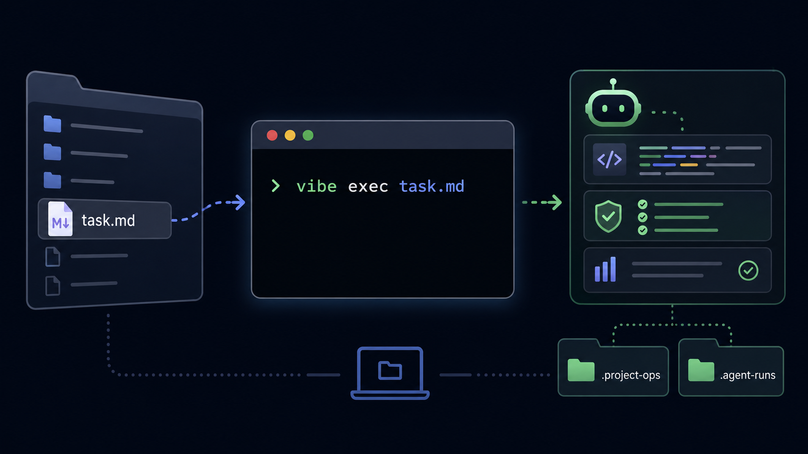

# Alice Coding

> Task-file-driven local AI coding workflow for Codex, Claude Code, and MCP.

<p>
  <a href="LICENSE"></a>
  <a href="https://github.com/Alice-ai22/Alice-Coding/releases/tag/v0.1.0"></a>
  
  
  
</p>

<p align="center">
  
</p>

Alice Coding lets you put a task file into a folder and ask an AI coding agent to work there. It turns Codex / Claude Code from a chat assistant into a local workflow that reads context, executes tasks, runs verification, and records what happened.

```text
task.md -> working directory -> project context -> agent execution -> verification -> run summary
```

## Quick Demo

```bash
git clone https://github.com/Alice-ai22/Alice-Coding.git
cd Alice-Coding
./scripts/install-local.sh

vibe start ~/Projects/my-app web-app
$EDITOR ~/Projects/my-app/task.md
vibe check-task ~/Projects/my-app/task.md
vibe exec ~/Projects/my-app/task.md --agent codex --mode workspace --dry-run
vibe exec ~/Projects/my-app/task.md --agent codex --mode workspace
vibe report --last-run --cwd ~/Projects/my-app
```

Default rule: **if `--cwd` is not provided, the task file's parent directory is the agent working directory.**

New task folders do not need to be Git repositories first. When `agent-runner` starts Codex in a non-Git folder, it automatically adds Codex's `--skip-git-repo-check` flag.

If the task file lives somewhere else, pass the project directory explicitly:

```bash
vibe exec ~/Desktop/task.md --cwd ~/Projects/my-app --agent codex --mode workspace
```

## Why Alice Coding

AI coding often gets stuck in a loop of repeated context: paste the requirement, explain the project, remind the agent how to verify, summarize the fix, then do it all again next time.

Alice Coding gives each project a local operating layer:

- task files for clear intent
- `.project-ops/` for project memory
- `.agent-runs/` for execution records
- MCP servers for skills, project context, verification, and references
- `agent-runner` for launching Codex or Claude Code in a repeatable way

## Workflow At A Glance

```text
task.md
  -> vibe check-task
  -> vibe exec
  -> generated plan
  -> agent-runner
  -> Codex / Claude Code
  -> verification
  -> .agent-runs summary
```

## What You Get

| Area | What it does |
| --- | --- |
| `vibe start` | Creates a project folder, `task.md`, and starter `.project-ops/` memory in one step. |
| `vibe task-template` | Creates task files from built-in templates. |
| `vibe check-task` | Scores task-file readiness on a 100-point scale and suggests missing context. |
| `vibe exec` | Converts a task file into an execution plan and launches an agent run. |
| `vibe run` | Runs a structured `.project-ops` task by task id or plan path. |
| `vibe report` | Generates a standard report from the latest `.agent-runs/` entry. |
| `vibe skill` | Checks or syncs source skill templates with installed Codex skills. |
| `agent-runner` | Starts Codex or Claude Code with a generated prompt and run directory. |
| `skills` MCP | Helps agents find and read local skills. |
| `project-ops` MCP | Reads and maintains requirements, tasks, plans, decisions, rules, and learnings. |
| `verification` MCP | Selects and records the smallest useful checks. |
| `reference` MCP | Searches and registers GitHub references without blindly copying code. |

## Built-In Templates

Task templates live in `templates/tasks/`:

| Template | Use it for |
| --- | --- |
| `default` | General implementation tasks. |
| `web-app` | Creating or improving a web app. |
| `bugfix` | Reproducing, fixing, and verifying bugs. |
| `docs` | Documentation updates. |
| `release` | Release prep and public checklist work. |
| `skill-improve` | Improving a Codex/Alice Coding skill and checking installed-template sync. |

There is also a completion report template in `templates/reports/` and a reusable Alice Coding skill template in `templates/skills/alice-coding/`.

## Project Memory

Long-running projects can keep their context in `.project-ops/`:

```text
.project-ops/
  requirements/
  product/
  plans/
  references/
  tasks.json
  verification.json
  decisions.md
  learnings.md
  project-rules.md

.agent-runs/
```

Alice Coding itself stays generic. Your private requirements, run logs, and learnings stay inside the target project folder.

## Common Commands

```bash
# Fast path from a task file
vibe start ./my-app web-app
cd ./my-app
vibe check-task ./task.md
vibe exec ./task.md --agent codex --mode workspace --dry-run
vibe exec ./task.md --agent codex --mode workspace
vibe report --last-run
vibe skill doctor alice-coding
vibe skill sync alice-coding

# Template-only path
vibe task-template web-app ./task.md
vibe task-template skill-improve ./skill-task.md

# Structured project workflow
vibe bootstrap --cwd . --fix
vibe ingest ./requirements.md --type requirements --cwd .
vibe task create TASK-001 "Implement MVP" --goal "Build the MVP from requirements" --cwd .
vibe run TASK-001 --agent codex --mode workspace --cwd .
vibe review --last-run --strict --diff --cwd .
vibe learn --last-run --cwd .
```

## Best For

- Developers using Codex, Claude Code, or terminal-based coding agents.
- Local-first AI coding workflows.
- Projects that need repeatable task execution and verification.
- Teams or solo builders who want project context to survive beyond one chat.

## Not For

- Replacing Codex, Claude Code, or human review.
- Cloud project management.
- Fully unsupervised production deployment.
- Copying third-party open-source code without approval and license review.

## Repository Map

```text
cli/
  vibe-cli/          main workflow CLI
  agent-runner/      Codex / Claude Code execution wrapper
mcp/
  skills-mcp-server/
  project-ops-mcp-server/
  verification-mcp-server/
  reference-mcp-server/
templates/
  tasks/             task file templates
  reports/           completion report template
  skills/            reusable Alice Coding skill template
docs/                quickstart, architecture, MCP, workflow docs
```

## Docs

- [Quick Start](docs/quickstart.md)
- [Task File Workflow](docs/task-file-workflow.md)
- [Architecture](docs/architecture.md)
- [Configuration](docs/configuration.md)
- [MCP Servers](docs/mcp-servers.md)
- [Project Purpose](docs/project-purpose.md)
- [Common Workflows](docs/workflows.md)
- [Roadmap](ROADMAP.md)
- [Security](SECURITY.md)
- [Contributing](CONTRIBUTING.md)

## Status

Current version: `v0.1.0`

This is an early public version focused on making local agent workflows repeatable, inspectable, and easy to explain.

## License

MIT. See [LICENSE](LICENSE).
